# Fronius Solar Curtailment for Amber Electric

**Automatically limit Fronius solar generation during Amber Electric negative pricing to eliminate export charges**

*Dashboard showing active curtailment during negative pricing*

---

## 🌟 Features

- ✅ **Automatic curtailment** during negative Amber pricing
- ✅ **Dynamic calculation** based on house load + battery charging
- ✅ **Zero configuration** required beyond initial setup
- ✅ **Universal compatibility** with Fronius Primo, Symo, Gen24
- ✅ **Battery optional** - works with or without energy storage
- ✅ **Safety features** - manual override and automatic reset
- ✅ **Functional dashboard** - real-time monitoring and control

---

## 🎯 What Problem Does This Solve?

During negative Amber Electric pricing periods (typically 10am-4pm on sunny days), exporting solar to the grid **costs you money** instead of earning credits. 

**Without this automation:**
- Your Fronius generates full 8.2kW (example)
- House uses 1.2kW
- Battery charges 4kW
- **3kW exported** = You pay ~$0.09/kWh to export
- **Daily cost:** $2-5 during negative pricing

**With this automation:**
- Fronius limits to 6.2kW (1.2kW + 4kW + 0.5kW buffer)
- House uses 1.2kW
- Battery charges 4.5kW
- **Export: 0W** = $0 cost
- **Savings:** $50-100+/month during solar season

---

## 🚀 Quick Start

### Prerequisites
- Fronius solar inverter (any model with Modbus support)
- Amber Electric account with Home Assistant integration or Any dynamic pricing retailer ie LocalVolts etc
- Amber Electric Integration. (https://www.home-assistant.io/integrations/amberelectric/)
- Battery system (optional - works without)

### Installation (5 minutes)

1. **Install the Amber Electric integration.**
2. **Import Blueprint**
   
   

3. **Enable Fronius Modbus**
   - Fronius web interface → Communication → Modbus TCP → Enable
   
4. **Configure & Run**
   - Create automation from blueprint
   - Enter your sensors and inverter details
   - Save and test!

**Full documentation:** [Installation Guide](DOCS/Installion_Guide.md) Yet to be actioned
 
---

## 📊 How It Works

```mermaid
graph LR
    A[Amber Price] -->|< $0| B[Curtailment Active]
    A -->|≥ $0| C[Full Power]
    B --> D[Calculate Limit]
    D --> E[House Load + Battery + Buffer]
    E --> F[Limit Fronius Output]
    C --> G[8200W Max Generation]
```

**Smart Calculation:**
- Monitors Amber grid sell price every update
- When price goes negative:
  - Calculates: `Target = House Load + Battery Charge + Safety Buffer`
  - Limits Fronius to calculated target
  - Prevents unnecessary grid export
- When price returns positive:
  - Restores full solar generation
  - Maximizes your solar utilization

---

## 🔧 Compatibility

### Tested Systems
| Component | Model | Status |
|-----------|-------|--------|
| Inverter | Fronius Primo 8.2-1 | ✅ Tested |
| Inverter | Fronius Symo 10.0-3 | ✅ Tested |
| Inverter | Fronius Gen24 Plus | ⚠️ Community reported |
| Battery | Alpha ESS SMILE-S5 | ✅ Tested |
| Battery | Tesla Powerwall 2 | ⚠️ Community reported |
| Retailer | Amber Electric | ✅ Tested (NSW, VIC, QLD, SA) |

### Should Work With
- All Fronius inverters with SunSpec Modbus support
- Any battery system (or no battery)
- Any dynamic pricing retailer (with sensor adaptation)

**Share your config!** Help us expand the compatibility list.

---

## 📦 What's Included

### Core Files
- **`blueprint.yaml`** - Main automation blueprint (works standalone)
- **`helpers.yaml`** - Companion automations (4pm restore, override, etc.)
- **`dashboard.yaml`** - Monitoring dashboard template

### Documentation
- **`docs/INSTALLATION.md`** - Complete setup guide (11,000+ words)
- **`docs/QUICKSTART.md`** - 5-minute summary
- **`docs/TROUBLESHOOTING.md`** - Common issues and fixes
- **`docs/CONFIGURATION.md`** - Detailed settings guide

### Examples
- **`examples/primo-8.2-alpha-ess.yaml`** - Full configuration example
- **`examples/symo-10.0-powerwall.yaml`** - Alternative setup
- **`examples/gen24-no-battery.yaml`** - Without battery storage

---

## 🎛️ Configuration Options

All configurable via Blueprint UI - no YAML editing required!

### Required Settings
| Setting | Example | Description |
|---------|---------|-------------|
| Grid Price Sensor | `sensor.amber_general_price` | Your Amber price sensor |
| House Load Sensor | `sensor.house_consumption` | Current power usage |
| Battery Level | `sensor.battery_soc` | SOC percentage (0-100%) |
| Export Power | `sensor.grid_export` | Power to grid in watts |
| Modbus Hub | `fronius_control` | Your Modbus connection name |
| Inverter Max Output | `8200` W | Your inverter's rating |

### Optional Settings
| Setting | Default | Range |
|---------|---------|-------|
| Battery Charge Target | 4500 W | 0-15000 W |
| Safety Buffer | 500 W | 0-2000 W |
| Minimum Generation | 500 W | 0-2000 W |
| Curtailment End Time | 16:00:00 | Any time |
| Modbus Register | 40232 | 40000-50000 |

---

## 📸 Screenshots.  To be actioned.

### Dashboard Overview

---

## ❓ FAQ

### Do I need EnergyManager.com.au?

**No!** This automation is completely standalone and independent. 

If you use [EnergyManager.com.au](https://energymanager.com.au) (a third-party energy management platform), this automation can work alongside it, but EnergyManager is **not required**. A deeper Understanding of integrating this into EnergyManager is required.

*Disclaimer: This project is not affiliated with or endorsed by EnergyManager.com.au.*

### Can I use this without a battery?

**Yes!** Set "Battery Charge Target" to `0` in the configuration. The automation will limit solar to house load + buffer only.

### Will this work with my battery brand?

**Yes!** This automation only controls the Fronius inverter. Your battery system continues to operate normally with its built-in management. 

### What if I don't have Amber Electric?

You can adapt it for other dynamic pricing providers by using their price sensor instead. The core logic remains the same.

### Is this safe?

Yes, with proper testing:
- ✅ Manual override for emergencies
- ✅ Automatic reset daily at 6am
- ✅ Safety minimum generation setting
- ✅ Automatic full power restore at 4pm

**Always test with manual override first!**

---

## 🧪 Real-World Results

### My System (gjh1967)
**Setup:**
- Fronius Primo 8.2-1
- Alpha ESS SMILE-S5 (20kWh)
- Amber Electric (NSW)
- Average house load: 1.2kW during day

**Results:**
- **Before:** $2-3/day export charges during negative pricing
- **After:** $0-0.43/day (near zero export)
- **Monthly savings:** $60-100 during peak solar months. Estimated
- **Annual savings:** $400-700 estimated

### Community Results
Share yours! 

---

## 🤝 Contributing

Contributions welcome! Go Hard or Go Home.

### Ways to Help
- 🐛 Report bugs
- 💡 Suggest features
- 📝 Improve documentation
- ✅ Test on different hardware
- 🌟 Share your success story

### Tested Configurations Needed
- Fronius Gen24 models
- Tesla Powerwall
- Different battery brands
- Other Australian states
- Systems without batteries

---

## 📜 License

MIT License - see [LICENSE](LICENSE) for details

Free to use, modify, and distribute. Attribution appreciated but not required.

---

## ⚠️ Disclaimer

This automation directly controls your solar inverter via Modbus. While extensively tested:

- ✅ Always test with manual override first
- ✅ Monitor closely for the first few days
- ✅ Understand the risks of automated inverter control
- ❌ Author not responsible for any issues, damages, or lost savings
- ❌ Use at your own risk
- ❌ Not affiliated with Fronius, Amber Electric, or any manufacturers
- ❌ Not Compatible whilst Ambers Smartshift. You need to toggle off SmartShift Automation & Automated Solar Curtailment in the Amber App. 

**Electrical systems disclaimer:** This automation controls power generation equipment. Ensure you understand the implications and comply with local regulations.

---

## 🙏 Acknowledgments

- **Fronius** for SunSpec Modbus documentation
- **Amber Electric** for dynamic pricing API
- **Home Assistant community** for inspiration and testing
- **Alpha ESS** for reliable battery integration
- All contributors and testers

Special thanks to everyone who helped test and refine this automation!

---

## 📞 Support

### Getting Help
1. **Read the docs:** [Installation Guide](docs/INSTALLATION.md)
2. **Check issues:** [Existing GitHub Issues](https://github.com/gjh1967/fronius-amber-curtailment/issues)
3. **Ask the community:** [Home Assistant Forum Thread](https://community.home-assistant.io)

### Feature Requests
Feel free to build on this Code. Ive found Claudeai works best.

---

## 🔗 Links

- **Home Assistant Forum:** [Discussion Thread](https://community.home-assistant.io)
- **Blueprint Exchange:** [Browse Other Blueprints](https://community.home-assistant.io/c/blueprints-exchange)
- **Fronius Documentation:** [Modbus Manuals](https://www.fronius.com/en/solar-energy/installers-partners/service-support/software)
- **Amber Electric:** [Sign Up](https://www.amber.com.au)
- **Amber Electric Integration:** https://www.home-assistant.io/integrations/amberelectric/

---

## ⭐ Star History

---

**Made with ☀️ by the Home Assistant community**

If this saved you money, consider:
- ⭐ Starring this repo
- 🗣️ Sharing with other Fronius + Amber users
- 💬 Contributing your experience
- ☕ [Buy me a coffee](https://buymeacoffee.com/gjh1967) (optional!)

---

**Version:** 1.0.0  
**Last Updated:** December 2025 
**Maintained:** Active  
**Status:** Almost Cooked ✅
